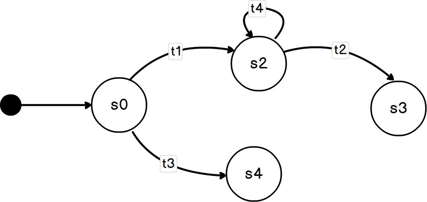

# Maszyna stanu w praktyce
Kod źródłowy pochodzący z mojego wystąpienia na konferencji [**MS Tech Summit 2022**](https://mstechsummit.pl)


## Wymagania
- .NET 6.0

## Uruchomienie

```
cd src/Shopper.ConsoleClient
dotnet run
```

## Abstrakt
Dzień z życia programisty:
Aplikacja wreszcie gotowa. Jutro prezentacja. Logika z mnóstwem warunków rozsianych po całym kodzie mozolnie przetestowana. Zapowiada się miły wieczór... 

Nagle telefon - _trzeba dodać nowy stan!_ Powoli osuwasz się z krzesła... Game Over. 

**Maszyna stanów skończonych** pewnie kojarzy ci się z nudnym wykładem, o którym zapomniałeś wraz z zaliczonym egzaminem na studiach. Nic bardziej mylnego. 

Zapoznaj się z kodem w tym repozytorium.

## Definicje
- **Maszyna stanów** to zbiór stanów _states_ (s0, s1, s2 ... sN) oraz przejść (t1, t2 ... tN). 
Maszyna może znajdować się tylko w jednym ze stanów w danym momencie.




- **Stan początkowy**  to stan (s0) w którym maszyna stanów rozpoczyna pracę (np. przyjęte)
- **Przejście własne** Przejście pomiędzy stanami uruchamianie za pomocą wyzwalacza _trigger_ (np. zatwierdź, anuluj, upłynął czas)
- **Akcje wejściowe** Czynności uruchamianie przy wchodzeniu do danego stanu (np. wysłanie emaila)
- **Akcje wyjściowe** Czynności uruchamianie przy opuszczaniu danego stanu.
- **Stan końcowy** Stan osiągany na koniec pracy. Maszyna może posiadach kilka stanów końcowych (np. zrealizowane, anulowane).


## Implementacja
1. Instalacja biblioteki
~~~ bash
dotnet add package Stateless
~~~

2. Utworzenie maszyny stanów
Określamy typ stanu _State_, typ wyzwalacza _Trigger_ oraz stan początkowy _Initial State_.
~~~ csharp
StateMachine<LampState, LampTrigger> machine = new StateMachine<LampState, LampTrigger>(LampState.Off);
~~~

3. Konfiguracja stanów i dopuszczalnych przejść
~~~ csharp
machine.Configure(LampState.Off)
    .Permit(LampTrigger.Push, LampState.On);

machine.Configure(LampState.On)
    .Permit(LampTrigger.Push, LampState.Off);
~~~

4. Konfiguracja akcji wejścia i wyjścia
~~~ csharp
machine.Configure(LampState.On)
    .OnEntry(() => Console.WriteLine("Light on"));
    .Permit(LampTrigger.Push, LampState.On)
    .OnExit(() => Console.WriteLine("Light off"));
~~~

5. Uruchamionie wyzwalacza
~~~ csharp
machine.Fire(LampTrigger.Push);
~~~

6. Pobranie bieżącego stanu
~~~ csharp
Console.WriteLine(machine.State)
~~~

7. Sprawdzenie czy jest możliwość uruchomienia wyzwalacza w aktualnym stanie
~~~ csharp
machine.CanFire(LampTrigger.Push)
~~~

## Diagnostyka

### Śledzenie maszyny stanów   
~~~ csharp
 machine.OnTransitioned(transition => Console.WriteLine($"{transition.Source} -> {transition.Destination}"));
~~~  

### Wizualizacja maszyny stanów

#### DotGraph
~~~ csharp
Console.WriteLine(Stateless.Graph.UmlDotGraph.Format(machine.GetInfo()));
~~~
- http://www.webgraphviz.com

#### Mermaid
- https://github.com/sulmar/stateless-mermaid
- https://mermaid.live/
 
## Arduino
- Biblioteka [**Automation**](https://github.com/tinkerspy/Automaton/wiki)
